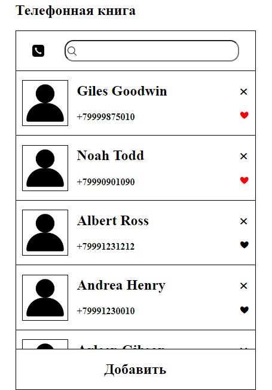
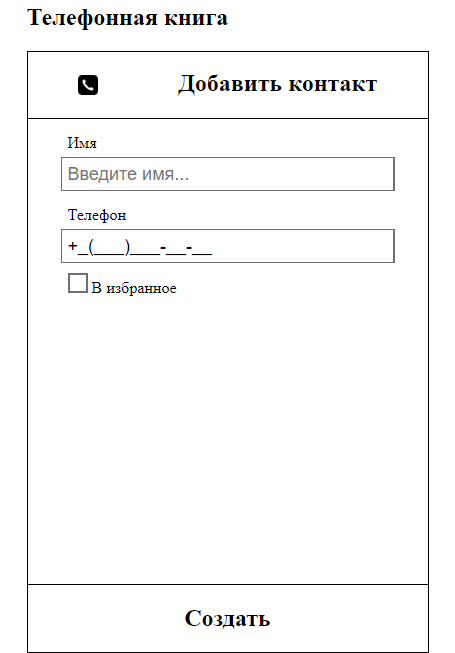

    <h1>Phone Book</h1>
    
Телефонная книга

---

## Скриншоты

## О проекте
Проект был создан как тестовое задание для компании MediaSoft.

## Используемые технологии
    

## Функционал
- Добавление/удаление контактов
- Добавление контакта в избранное
- Поиск контакта по имени/номеру телефона

***Хранение данных реализовано через СУБД MySQL***

## Особенности
- Закрытие окна добавления контакта осуществляется на клавишу **`Esc`**
- Ввод номера телефона по маске

## Подготовительные работы
1. Создать базу данных
2. Импортировать дамп *contacts.sql*, находящийся в корне проекта
3. Настроить файл подключения к БД по пути *`php/connection.php`*
4. Запустить проект на сервере